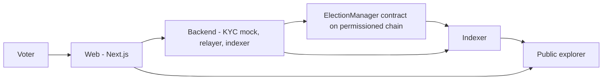

# AIA Vote — Aadhaar ZK-Gated Permissioned Blockchain E-Voting

A hackathon prototype for the Election Commission of India: an **Aadhaar ZK-gated permissioned blockchain** voting protocol with **EVM shadow-audit mode** and remote voting for **migrants/NRIs**.

- Voters prove eligibility with a mock Aadhaar/DigiLocker KYC check, then join a Semaphore group per election.
- Votes are Semaphore zero-knowledge proofs: candidate choice is public, voter identity stays unlinkable, nullifiers stop double voting.
- Election control sits behind an ECI multi-sig; a backend relayer/indexer keeps gas and UX simple.
- Shadow audit: booth-level EVM counts can be cross-checked against the on-chain tally via the audit endpoint, with everything visible on a public explorer.

## Architecture



- `Voter -> Web`: voter app (KYC flow, Semaphore identity, vote casting, receipts).
- `Web -> Backend (KYC mock, relayer, indexer)`: REST `/api` + WebSocket `/ws`.
- `Backend -> ElectionManager contract on permissioned chain`: `registerVoter` (registrar) and `castVote` (relayed) transactions.
- `Indexer -> Public explorer`: indexed `VoteCast` / `PhaseChanged` / `VoterRegistered` events, tallies, and receipts.

See `docs/SPEC.md` for the source-of-truth contract + API spec.

## Quickstart (placeholder)

> TODO: fill in after `contracts/`, `backend/`, `web/` are scaffolded by their owners.
> Expected flow:

```bash
cp .env.example .env
# edit .env (secrets, RPC URLs)
docker compose up -d        # postgres:16 on 5432
# terminal 1: hardhat node (run via npm script, not docker)
#   cd contracts && npm install && npm run node
# terminal 2: backend
#   cd backend && npm install && npm run dev
# terminal 3: web
#   cd web && npm install && npm run dev
```

- Hardhat node: `http://localhost:8545`
- Backend: `http://localhost:4000`
- Web: `http://localhost:3000`

## Prototype notes

- **Aadhaar/DigiLocker is mocked.** `MOCK_KYC=true` by default; `/kyc/start` and `/kyc/complete` return fake sessions/tokens. No real Aadhaar numbers are ever collected, transmitted, or stored.
- Permissioned chain is a local Hardhat network in this prototype, standing in for an ECI-operated chain.
- Semaphore proofs are real client-side ZK proofs; eligibility bridging (mock KYC token → identity commitment) is trusted mock code, not ECI infrastructure.
- Do not use this prototype for real elections.
